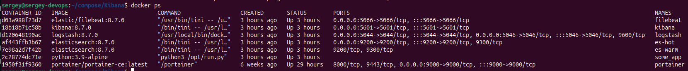
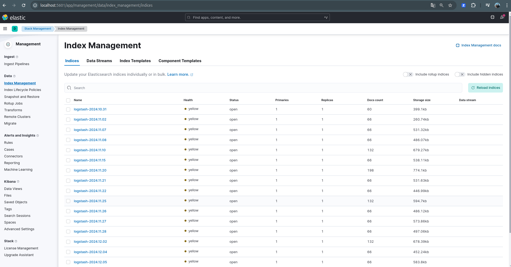
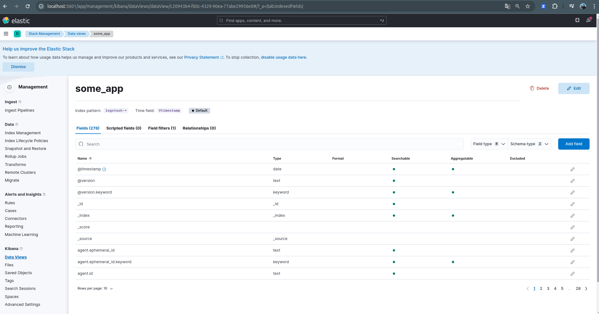
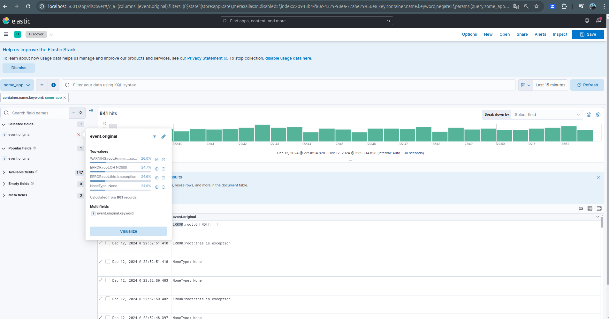
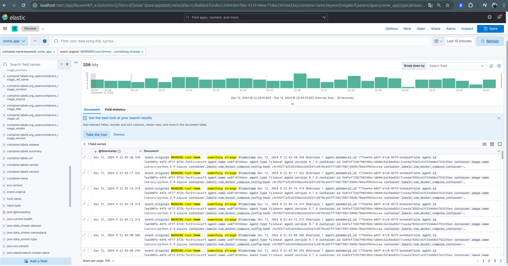
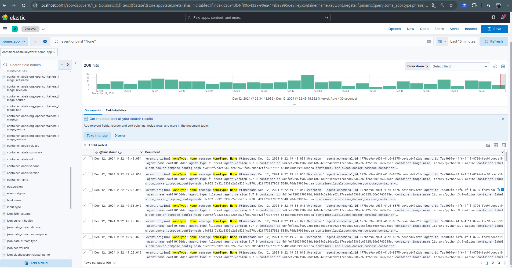

[Задание](https://github.com/netology-code/mnt-homeworks/blob/MNT-video/10-monitoring-04-elk/README.md)

#### Запуск контейнеров
  

  

#### Фильтры
Создаём DataView в Kibana:  

##### Kibana - Analytics - Discover
Можем выбрать фильтр по конкретному значению и указать, какие поля включать:  

Фильтр по конкретному значению:  

Фильтр по подстроке:  

